# Evaluation of the Microstructure and Performance of Fe-21Cr-15Ni-6Mn-Nb Nonmagnetic Stainless Steel Welded Joints

Kun Li, Chang-Sheng Li, Yanlei Song, Bin-zhou Li, Jingbo Dong, Renfu Wang, and Yuxiang Zhang

(Submitted May 24, 2018; in revised form June 25, 2019)

In the present study, double-sided gas shield welding (GSW), in a single pass, was applied to Fe-21Cr-15Ni-6Mn-Nb nonmagnetic stainless steel plate. The microstructure and performance of the welded joint were investigated via microstructural and phase analysis, mechanical testing and magnetic analysis. The results showed a satisfactory micrographic appearance with full penetration, and no solidification defects observed in the welded joint, which showed typical epitaxial growth characteristics in the welding solidification. Slight grain growth, with an average size of   $  \sim18.9\ \mu m  $  , occurred in the heat-affected zone (HAZ). The primary dendrite arms, on both sides of welding joint, grew along the direction of the temperature gradient and met at the centerline of the weld with no parting microstructure in evidence. The secondary dendrite arm spacing was stable in all parts of the weld zone (WZ). The hardness of the weld zone was higher than that of the HAZ and the base metal (BM), with the lowest hardness occurring in the HAZ. The results of tensile testing showed a higher strength of the welded metal (WM) compared to the BM, and a good strength-ductility balance of the welded joint. The impact energy of the HAZ was higher than that of the WZ, corresponding to 60.5 J at room temperature and 52.7 J at   $  -196\ ^{\circ}C  $  . Microvoid coalescence, concurrent with crack propagation along the direction of the long axis of the dendritic sub-grains, was observed during plastic deformation in the WZ. Additionally, the excellent paramagnetic characteristics of the welded specimens were revealed.

Keywords impact toughness, magnetic permeability, nonmagnetic stainless steel, strength, welded joint

# 1. Introduction

Austenitic stainless steels (ASSs) have been widely used due to their unique properties, such as excellent corrosion resistance, high work hardenability, outstanding formability, good weldability and outstanding performance at cryogenic temperatures (Ref 1, 2). They have been regarded as a backbone structural material for many components in various industries (Ref 3). In addition to the above excellent properties, the stable ASSs exhibit typical paramagnetic properties and are also known as nonmagnetic ASSs. Because of their excellent nonmagnetic properties, nonmagnetic ASSs have been a primary choice for special or harsh application fields, such as cryogenic superconducting, nuclear fusion reactors, electronic measuring equipment and concrete reinforcing bars for radar installations (Ref 4, 5). Thus, nonmagnetic ASSs have been considered as a far-reaching and extensive application material.

Rapid development in industry has established a demand for structural materials with increased strength and toughness (Ref

6). For conventional ASSs, their applications are limited due to their low level of strength, toughness and magnetic properties (Ref 7). With regard to the strengthening of unstable ASSs, the cold or cryogenic rolled sheet, subsequently subjected to an annealing procedure, is widely, and successfully, used by many researchers. The strengthening is predominantly due to the inverse transformation of strain-induced martensite. However, the addition of austenitic stabilization and strengthening elements, such as Cr, Ni, Mo, Nb and V, is the preferred strengthening method due to the absence of a phase transformation in nonmagnetic ASSs (Ref 8). Fusion welding, which is the preferred method for the manufacture of components among the various fabrication technologies, is widely used in many industrial applications (Ref 9). Thus, a large number of welded joints often exist in structural components, and the service life, and safety of the components depends on the reliability of the welded joints. The performance of welded joints is closely associated with their metallurgical evolution, including the stability of  $ \gamma $ -phase, grain coarsening in the heat-affected zone (HAZ), martensitic transformation, precipitation of carbonitrides, sensitization, cracking and welding decay (Ref 10). In the present experimental steel, the increase in the alloying element content will inevitably lead to a change in the pinning effect of precipitates, the stacking fault energy (SFE) and the diffusion coefficient during welding solidification. Therefore, many studies have been conducted on the welding of ASSs. For instance, Xin et al. reported the influence of precipitates on the microstructure and mechanical properties of ITER-grade 316LN austenitic stainless steel, TIG-welded, joints after various aging parameters (Ref 3). Although the aging increases the elongation, and has no detrimental effect on the tensile strength, the TIG-welded joints of 316LN austenitic

stainless steel still exhibit a relative lower strength. Ramkumar et al. (Ref 11) studied the metallurgical and mechanical characterization of dissimilar welds of austenitic stainless steel. It was stated that there is a balanced amount of austenite and ferrite in the fusion zone of the AISI 316L austenitic stainless steel, with ER2553 welding wire, and the tensile strength, yield strength, hardness value and the impact toughness, of the ER2553 weldments, were 301 MPa, 641 MPa, 291 HV and 178 J, respectively. Kianersi et al. (Ref 12) reported on the phase transformations, mechanical properties and the microstructural characterization of resistance spot welded joints for AISI 316L austenitic stainless steel sheets. With an increase in the welding current, the size of the weld nugget and the tensile-shear bearing capacity increased, and the excessive heat input led to the coarsening of the weld nugget microstructure and the generation of acicular δ-ferrite. Mukherjee et al. (Ref 9) investigated the microstructure and mechanical properties of Fe-16Cr-1Ni-9Mn-0.12 N austenitic stainless steel, gas shielded welding (GMAW), welded joints. This investigation exploited the proper welding procedure/conditions for Fe-16Cr-1Ni-9Mn-0.12 N steel based on the experimental examination of different modes of metal transfer, and austenitic filler metals, in two shielding gas environments. A study on the low magnetic permeability gas tungsten arc weldment (GTAW) of AISI 316LN stainless steel, for application in an electron accelerator, was performed by Kumar et al. (Ref 13). In their investigation, utilizing a high Mn adaptation of W 18 16 5 N L welding filler, a crack-free nonmagnetic weld, with an acceptable combination of magnetic and mechanical properties, was achieved. Similarly, Sgobba and Hochoertler conducted an investigation on high Mn, high N ASS P506 (C: 0.03%; Cr: 19-19.5%; Ni: 10.7-11.3%; Mn: 11.8-12.4%; Mo: 0.8-1%; Si: ≤

0.5%; N: 0.3-0.35%; Fe: Bal) autogenous welds. The welded joint exhibited a full austenite microstructure against a δ-ferrite formation, as well as against its transformation to strain-induced martensite during deformation at low temperatures (Ref 14). Particularly, when nonmagnetic ASS is to be used in manufacturing protective devices served in an applied magnetic field, excellent paramagnetic property also should be ensured except the sufficient strength and ductility. In terms of the conventional solidification mode, in the welding solidification, the austenite-ferrite mode (AF) is often primarily considered. Although this method can prevent the occurrence of hot cracks and improve the final performance of the welded plate, it is difficult to guarantee the paramagnetic performance of nonmagnetic ASS components. From the above studies, it can be seen that the evaluation of the properties of welded joints, of nonmagnetic ASSs, has received little attention. In this paper, on the basis of a consideration for reliability, cost-effectiveness, techno-economics and practicability, the well-designed GSW process was applied to hot-rolled, experimental, nonmagnetic ASS plate. It is important to note that the newly developed Fe-21Cr-15Ni-6Mn-Nb nonmagnetic ASS, from the current

Table 1 Chemical composition (in wt.%) of base metal and filler wire (Fe balance)

|             | C     | Si    | Mn   | P      | S      | Mo   | Ni    | Cr    | Nb   | V    | N     |
|:------------|:------|:------|:-----|:-------|:-------|:-----|:------|:------|:-----|:-----|:------|
| Base metal  | 0.18  | 0.203 | 5.9  | 0.0048 | 0.0044 | 0.50 | 14.85 | 20.25 | 1.34 | 0.35 | 0.368 |
| Filler wire | 0.035 | 0.35  | 6.7  | 0.0031 | 0.0030 | 1.6  | 15.2  | 21.8  | 1.8  | 0.38 | 0.18  |

research group, has indicated better mechanical properties, as compared to conventional ASS (Ref 15, 16). Additionally, due to the relative lower strength of conventional ASS welded joints, a filler metal with a reasonable high strength was designed in the present study. Subsequently, the evaluation of the welded joint was conducted by analysis of the microstructure, mechanical properties, including microhardness tests, tensile tests at ambient temperature, Charpy impact tests in a temperature range from ambient temperature to  $ -196^{\circ}\mathrm{C} $ , and magnetic analysis of the welded specimens after deformation in both ambient and cryogenic conditions.

# 2. Experimental Procedure

# 2.1 Material and Treatments

The base metal (BM) used in the present study was prepared from hot-rolled Fe-21Cr-15Ni-6Mn-Nb steel plate with a thickness of 12 mm and solution-treated at 1100 °C for 1 h, followed by water quenching. A designed filler wire (FW) of 1.2 mm size in diameter was used in the study. Meanwhile, the yield strength (YS) and ultimate tensile strength (UTS) of the nonmagnetic stainless steel welded joints were required to be not less than 550 and 880 MPa, respectively. The chemical composition of the BM and FW is shown in Table 1. In order to weaken the post-welding deformation, a double V-groove joint is applied to the GSW process, as shown schematically in Fig. 1. The parameters of the GSW process are shown in Table 2.

The microstructures along the cross section including the BM, HAZ and WM were examined by utilizing optical microscopy (LEICA DMIRM) and electron backscatter diffraction (EBSD, Oxford Instruments, INCA Crystal). Metallographic specimens were mounted, ground and polished by a standard preparation method with 240-, 400-, 800-, 1200- and 1500-grit emery paper, and subsequent mechanical polishing with diamond paste. A colloidal alumina solution was utilized for the final polishing. Electrolytic etching with  $ 60\% $  nitric acid aqueous solution at a potential of  $ 21 - 28\mathrm{V} $  and etching times ranging from 20 to  $ 30~s $  were utilized to reveal the metallographic microstructures. The specimens for EBSD were prepared by electro-polishing using an electro-polisher (ElectroMet4). The electrolyte consisted of  $ 12.5\% $  perchloric acid and  $ 87.5\% $  of absolute ethyl alcohol, with the voltage, electric current and time for electro-polishing being  $ 35\mathrm{V} $ ,  $ 1.8\mathrm{A} $  and  $ 25~s $ , respectively. A step size of  $ 0.5\mu \mathrm{m} $  was selected for the EBSD scans.

# 2.2 Performance Examinations

Microhardness distributions were measured along the cross section of the welded plate using an automatic turret digital microhardness tester (FUTURE-TECHFM-700) with a 200gf

load and 5 s dwell time. The average values, at six different locations, and at the same depth, were measured.

The tensile and impact specimens were prepared by a wire-electrode cutting process in which the extracted locations, from the welded plate, are shown in Fig. 2. Two different types of tensile tests were conducted. The first was used for evaluating the transverse tensile properties, and the second was an investigation on the strength of the WM, respectively. The transverse tensile specimens, with full thickness, are in accordance with ASTM E8M-04 guidelines. Owing to dimensional limitations, the size of the WM specimens was  $ 3\mathrm{mm} $  in diameter and  $ 30~\mathrm{mm} $  in length. The tensile test was performed using a CMT-5105 electron universal testing machine controlled by a computer at a crosshead speed of  $ 3\mathrm{mm / min} $ . The Charpy impact tests were also divided into two groups. The size of the impact specimen was  $ 10\mathrm{mm} \times 10\mathrm{mm} \times 55\mathrm{mm} $ , and the impact energy value was  $ 450\mathrm{J} $ . The locations of the V-notch, with a depth of  $ 2\mathrm{mm} $ , were selected in the HAZ and WZ, respectively. The V-notch of the HAZ was approximately  $ \sim 1.2\mathrm{mm} $  from the fusion line (FL). Impact tests, with the temperature ranging from ambient temperature  $ (20^{\circ}\mathrm{C}) $  to liquid nitrogen temperature  $ (-196^{\circ}\mathrm{C}) $ , were performed by a pendulum impact tester, and the mean values for three specimens, under each set of conditions, were measured. The

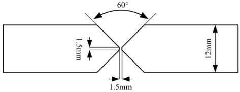

Fig. 1 Groove design of welding joint

Table 2 Parameters of gas shield welding of  $  {12}\mathrm{\;{mm}}  $  in thickness experimental steel plate

| Filler wire dia., mm   | Voltage, V   | Current, A   | Welding speed, mm/s   | Gas flow rate, L/min   | Shielding gas   |
|:-----------------------|:-------------|:-------------|:----------------------|:-----------------------|:----------------|
| 1.2                    | 200          | 25           | 5                     | 15-18                  | 95%Ar + 5%CO2   |

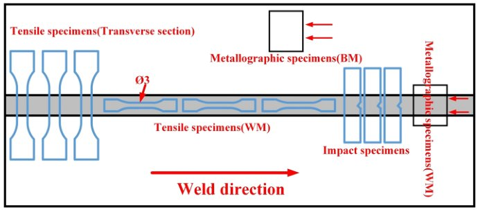

Fig. 2 Schematic representation of specimens for experiment examination

morphology of the fracture surface was observed by field emission scanning electron microscopy (FE-SEM, ULTRA-55).

The phase analysis was carried out on using an x-ray diffractometer with Cu Ka radiation with the  $ 2\theta $  ranging from  $ 20^{\circ} $  to  $ 100^{\circ} $ . The relative permeability  $ (\mu) $  was detected by a LakeShore 7407 vibrating sample magnetometer (VSM) with a maximum magnetic field of  $ 18\mathrm{kOe} $  operating at room temperature.

# 3. Results and Discussion

# 3.1 Analysis of Welding

The main element contents of the FW, in the present study, were higher than that of the BM except for the C and N contents. Meanwhile, the contents of P and S were kept at a significant low level, as shown in Table 1. It is well known that solidification cracks frequently occur during the welding process, and in turn, they are directly associated with the post-welding properties of the materials. Generally, S, P, Si and Nb are considered as harmful elements in the welding of ASSs owing to the formation of low-melt-point eutectic films with Fe, Cr and Ni, along the inter-dendritic and grain boundary areas, which can decrease the solidus temperature (Ref 17). The increase in cracking sensitivity of the welded joint will take place due to the widening of the solidification range caused by the formation of low-melting eutectics.

In practice, there are two important controlling factors for solidification cracking in ASSs welding. At first, the element segregation depends strongly on the chemical composition of the filler metal, and this determines the wetting characteristics and constitutional supercooling. Moreover, the lower C content in the FW, compared to the BM, can inhibit the existence of chromium depleted regions, along the inter-dendritic or grain boundaries, and this is in favor of the enhanced corrosion resistance for the welded joints. Although N has been accepted by many researchers as a strong austenitic stabilization and

interstitial strengthening element, it does not always have a beneficial effect on the resistance of crack sensitivity in ASS welding. As discussed in a previous study, the crack sensitivity increases when the N content is up to 0.2% (Ref 18). In addition, the low-melt-point eutectics indicate extreme low solubility in the austenite matrix and high solubility in δ-ferrite. In order to reduce the precipitation of low-melt-point eutectics, δ-ferrite needs to exist in the solidification process of liquid welded metal, but completely converted to austenite at ambient temperature. As proposed by Araki et al. (Ref 19), the addition of a higher Mn content, in the filler metal, is an effective way to obtain a microstructure of full austenite in the welded joint. This is because Mn can assist δ-ferrite to solidify at elevated temperature and transform rapidly to austenite at lower temperatures. Additionally, Mn, as an effective desulfurizer, also plays a strong role in steel metallurgy where the elimination of S is due to the formation of MnS.

On the other hand, the final structure of the solidification interface is determined by the solidification mode. The conventional method to prevent the formation of solidification cracking is the acquisition of a certain proportion of   $  \delta  $   ferrite, and in turn, the duplex   $  \gamma/\delta  $  -ferrite structure that is produced is helpful for the elimination of cracks (Ref 13). Hence, for all conventional ASS welding, the filler metal, including ER316L and ER317L of AWS A5.9, produces the duplex microstructure of   $  \gamma  $   phase with   $  \delta  $  -ferrite (3-8%) in the WM (Ref 13, 18). However, the deterioration of the paramagnetism cannot meet the paramagnetic requirements for special service environments (Ref 13, 20). In terms of the BM, the microstructure can be predicted by following equations developed by Brooks and Thompson, as follows: (Ref 9, 20)

$$
\mathrm{Cr} _ {\mathrm{eq}} = \mathrm{Cr} \% + \mathrm{Mo} \% + 0. 5 \times \mathrm{Nb} \% + 1. 5 \times \mathrm{Si} \%
$$

(Eq 1)

$$
\mathrm{Ni} _ {\mathrm{eq}} = \mathrm{Ni} \% + 30 \times \mathrm{C} \% + 0.5 \times \mathrm{Mn} \%
$$

(Eq 2)

with the average values of   $  Cr_{eq}  $   and   $  Ni_{eq}  $   calculated to be 20.7245 and 23.2, respectively, in the experimental steel. According to the Schaeffler diagram, this confirms the complete austenite phase for the BM. The prediction of the microstructure in the WM not only depends on the chemical composition of the filler metal, but also considers the influence of the solidification rate. However, the Schaeffler diagram, the Delong diagram and the WRC-1992 diagram, which are frequently used, focus dominantly on the transformation between austenite and ferrite under rapid solidification conditions (Ref 21), and do not consider the effect of solidification rate on the final microstructure. As shown in Fig. 3, the diagram proposed by Lippold et al. (Ref 22) can also be applied to rapid rate welding. The diagram was determined on the basis of the effect of solidification rate, together with the chemical composition, on the final microstructure in the welded joint. In their work, the solidification rate is considered to be equal to the welding speed, and then, the solidification mode for the ASS can be determined either by the AF or by the solidification rate. According to the Schaeffler diagram, in the present work the   $  Cr_{eq}/Ni_{eq}  $   is calculated to be   $  \sim1.27  $  , as marked in Fig. 3, which is located in the full austenite region. It is interesting to note the value of   $  Cr_{eq}/Ni_{eq}  $   belongs to the lower level in the given range. The presence, or absence, of   $  \delta  $  -ferrite is closely related to the value of   $  Cr_{eq}/Ni_{eq}  $  . No ferrite is predicted under a lower   $  Cr_{eq}/Ni_{eq}  $   ratio, whereas a higher   $  Cr_{eq}/Ni_{eq}  $   ratio is responsible for the remnants of intercellular ferrite.

# 3.2 Microstructures

Figure 4 shows the typical austenitic microstructure of the BM, which is predominantly composed of equiaxed grains with an average grain size of  $ \sim 15.8\mu \mathrm{m} $  (excluding twins), and annealing twins, in a single or parallel line morphology, were observed in the equiaxed grains. The XRD analysis of the base metal showed the single austenitic phase without any carbonitrides being observed.

The evaluation of welding quality is based on the penetration extent of the welding deposit, and the presence, or absence, of solidification defects in the welded joint. As shown in Fig. 5(a), it can be seen that a satisfactory macro-appearance with complete penetration, and no existence of solidification defects, was achieved in the welded joint. The WZ is divided into three parts along the centerline, and zones I, II and III correspond to the welding tip, the welding center and the welding root, respectively. X-ray measurements for both the HAZ and WZ depict a single austenite phase without any  $ \delta $ -ferrite, or visible precipitations, in the welded joint, as shown in Fig. 5(b).

For double-sided GSW, the WM obtained from the first weld pass can be regarded as the HAZ of the second pass. Thus, the WM of the first pass is subjected to, in effect, high-temperature annealing which may lead to a coarsening of the microstructure. As reported by Vashishtha et al. (Ref 23), a coarsened microstructure in the HAZ frequently occurs during high-speed welding. Furthermore, the thermal conductivity of ASSs is relatively lower, compared to other steels, during the weld thermal cycle (Ref 24). Thus, the high proportion of remnant heat will be stored, directly resulting in grain growth in the HAZ, which sharply destroys the mechanical properties of the welded joints. Nevertheless, this phenomenon does not occur in the WM of the first weld pass, as indicated in Fig. 5(c) and (d). Thus, in the present study the microstructural examinations were performed on the first weld pass. It can be clearly seen from Fig. 5(d) that the morphology of the microstructure gradually changes from columnar grains into fine cells, in the fusion zone (FZ), growing toward the center area of the welding pool, and the nugget microstructure reveals a typical characteristic of epitaxial solidification. As shown in Fig. 5(d), a narrow and slight grain growth, with a width of  $ \sim 55\mu \mathrm{m} $ , occurs in the HAZ, with an average grain size of  $ \sim 18.9\mu \mathrm{m} $  adjacent to the BM. No abnormal growth in the BM and HAZ was achieved in the present welding which may be due to the pinning effect of precipitate particles, which form at amounts below  $ 5\% $ , and cannot be detected by the x-ray analysis (Ref 25). As can be observed in Fig. 5(e), the microstructure in the center of the WZ is predominantly composed of a mixture of parallel primary dendrites and equiaxed cells. The primary dendrites grow in a preferred orientation, perpendicular to the welding boundary of the two sides, and meeting at the weld center layer of the WZ with no noticeable parting microstructure (Ref 21).

The as-cast material is influenced by many factors including grain size, defects (porosity, inclusion and microshrinkage), secondary dendrite arm spacing (SDAS), the shape and distribution of the primary crystals, the eutectic structure and the cooling rate. In particular, SDAS plays a dominant role in the mechanical properties of the solidification microstructure. Meanwhile, the SDAS strongly depends on the cooling rate, and the relationship with cooling rate can be represented by the following equation: (Ref 21)

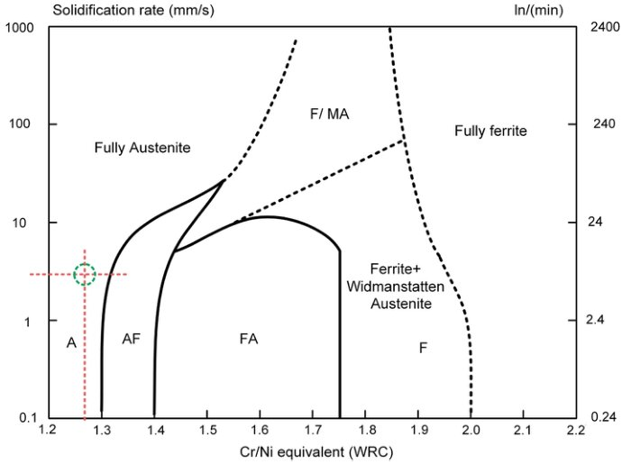

Fig. 3 Microstructural image of the dependence of experimental steel on composition and solidification ra

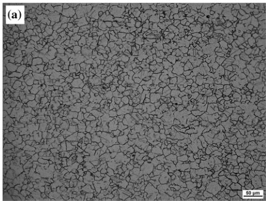

(a)

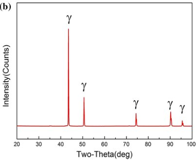

(b)

Fig. 4 Microstructure of BM subjected to solution treatment at  $ 1100^{\circ}\mathrm{C} $  for 1 h. (a) Microstructure of BM and (b) x-ray analysis

$$
\lambda = 2 5 (\varepsilon) ^ {- 0. 2 8}
$$

(Eq 3)

where   $  \lambda  $   represents the SDAS and   $  \varepsilon  $   is the cooling rate. It is known from this formula that the larger the cooling rate is, the finer SDAS is obtained. It also implies that the various cooling rates, in different locations, will result in the inhomogeneity of the SDAS distribution, which will weaken the coordination ability of plastic deformation. In the present work, the multiple orientation line intercept method was applied to the SDAS measurements in different locations of the WZ, as shown in Fig. 5(a) (I, II, III). The measured results indicate that there are few differences in the SDAS for regions I, II and III, all being distributed around   $  \sim7.8\ \mu m  $  , which is significantly smaller than the secondary dendrite arm spacing of   $  \sim10.3\ \mu m  $   in the FZ. Thus, this distribution of SDAS

reveals the finer and relative uniform microstructure in the WZ compared to the FZ and HAZ. It also indicates the high stability of the heating cycle during welding. Meanwhile, it also demonstrates that a narrow range, and a uniform distribution, of cooling rates is obtained during the whole welding process (Ref 26). These investigations show that a single phase, with a finer microstructure, can be achieved under low   $  Cr_{eq}/Ni_{eq}  $   concurrent with a narrow range and uniform distribution of the cooling rate (Fig. 6).

# 3.3 Mechanical Properties

3.3.1 Microhardness. The Vickers microhardness distribution of the welded specimen, along the cross section, was measured and is shown graphically in Fig. 7. It can be seen that

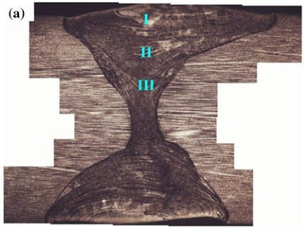

(a)

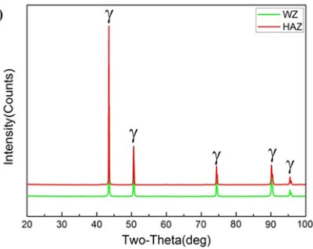

(b)

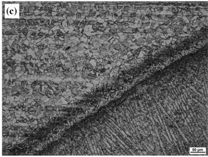

(c)

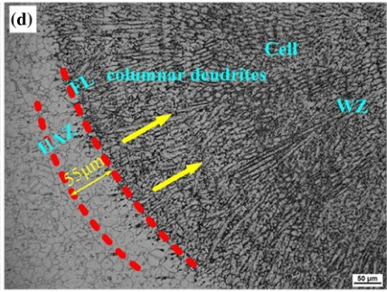

(d)

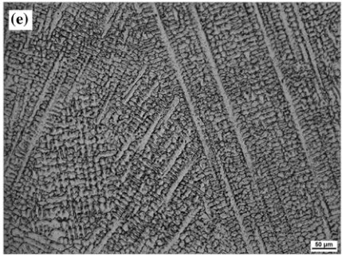

(e)

Fig. 5 Microstructure and phase analysis of the different locations of the welded joint. (a) Macro-morphology of weld; (b) phase analysis of weld; (c) second pass of weld; (d) first pass of weld; (e) structure of central layer of weld

the peak value (  $  \sim  $   307.5HV) lies in the center of the WZ, and the lowest value (  $  \sim  $   275.8HV) is observed in the HAZ. Meanwhile, the average microhardness of the BM is   $  \sim  $   286.5HV. The microhardness profile indicates a trend that the microhardness gradually increases up to the highest level in the WZ after the lowest value in the HAZ. It is well known that microhardness can be regarded as a reflection of microstructure, in which the grain size distribution determines the microhardness distribution in polycrystalline materials. Hence, the present microhardness profile can be interpreted by a typical Hall-Petch relationship. Thus, the minimum microhardness, in the HAZ, may be ascribed to the relative coarse microstructure (Ref 27). An increased trend in the hardness profile is attributed to the

changes from columnar grains into fine cells. It is also well known that finer grains mean higher strength or hardness. Generally, the smaller dendrite arm spacing (DAS) in the WZ can be considered as the finer microstructure. The result of the SDAS measurements showed that the microstructure of the WZ was finer than that of the HAZ and FZ. Meanwhile, due to the larger grain size in the HAZ, compared to that in the BM, and the smaller secondary dendrite arm spacing in the center of the weld joint, compared to that in the area near the fusion line, then according to the Hall-Petch relationship the hardness of the HAZ is the lowest, and the hardness of the center of the weld is the highest in the whole weld joint, which is in accordance with the actual measured results. Moreover, the

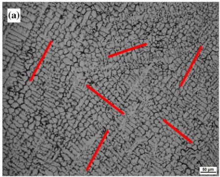

(a)

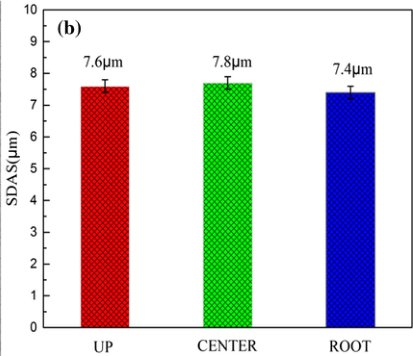

(b)

Fig. 6 SDAS measurement of the upper, center and root layers of WZ via multiple orientation intercept

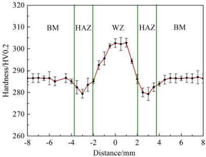

Fig. 7 Microhardness distribution profile of welded plate

Table 3 Yield strength (YS), ultimate tensile strength (UTS), elongation (ELO), product of strength and elongation (PSE) of the experimental steel

|              | YS, MPa   | UTS, MPa   | ELO, %   | PSE, MPa%   |
|:-------------|:----------|:-----------|:---------|:------------|
| Base metal   | 550.6     | 852.7      | 50.3     | 42890.9     |
| Welded joint | 570.6     | 879.3      | 42.2     | 37106.5     |
| Welded metal | 602.7     | 894.6      | 34.5     | 30863.7     |

hardening of the dendritic sub-grain boundary (Ref 28, 29) and the high dislocation density (Ref 21, 30) in the WZ are responsible for the higher microhardness. In addition, the stable microhardness level in the HAZ implies the heat input maintains a significant steady state during the welding thermal cycle.

3.3.2 Tensile Test. The transverse tensile properties for the BM and welded joint, and the tensile properties of the WM, at ambient temperature, were evaluated, and the results are presented in Table 3. Typical engineering stress versus true strain curves are plotted in Fig. 8. It is important to note, in the present work, that the final failure during the tensile testing of the welded specimens occurs in the BM rather than the WM. In

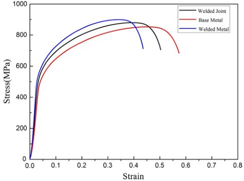

Fig. 8 Typical engineering stress vs. true strain curves of the welded and BM and WM

general, the locations of the final failure always occurred in the weakest part of the tested specimens during deformation. It can be clearly seen from Table 3 and Fig. 8 that the strength of the WM is higher compared to the BM. Hence, the plastic deformation occurs firstly in the BM, leading to the fracture in the BM during the tensile deformation. With regard to the lower elongation for the welded joint, this is mainly due to the lower plastic deformation ability of the WM compared to the BM. Through the analysis of the microstructure, it can be seen that the grain size of the WM is significantly smaller than the grain size of the BM, resulting in the higher strength of the WM. However, due to the presence of dendrite segregation, the plastic toughness of the WZ will inevitably be affected. It is worthwhile to note that the strength of either the BM, or the welded joint, is higher than that of conventional ASSs (Ref 31, 32). A further investigation on the fracture appearance characteristics of the tensile specimens was conducted by SEM, as shown in Fig. 9. It can be clearly seen that typical dimples, with no cleavage, or cleavage-like, facets are depicted on fracture surface, and larger and deeper dimples are observed in the BM fracture compared to the WM. Additionally, all of the tested specimens revealed high product of strength and elongation

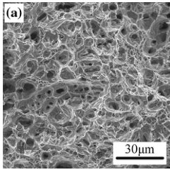

(a)

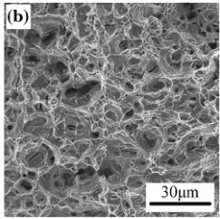

(b)

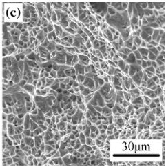

(c)

Fig. 9 SEM micrographs of fracture surface of different tensile tested specimens from (a) BM, (b) welded joint and (c) WM

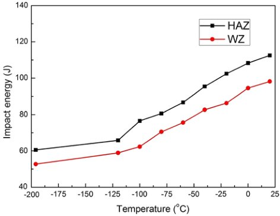

Fig. 10 Charpy V impact energy in the temperature range from 20 to  $ -196^{\circ}\mathrm{C} $

(PSE), which can be considered as a favorable balance of strength and ductility for metallic materials in engineering applications (Ref 33).

3.3.3 Impact Test. Nonmagnetic ASSs welded structural components serve not only at ambient temperature (20 °C), but also at cryogenic temperatures, as low as liquid nitrogen temperature (  $  -196\ ^{\circ}C  $  ). In the welded joint, the HAZ and WZ are regarded as the relative weaker parts with a decrease in service temperature (Ref 29). Figure 10 shows the impact energy of the HAZ and WZ in the temperature range from room temperature to   $  -196\ ^{\circ}C  $  . It can be observed that the impact energy of the HAZ is higher than that of the WZ. The impact energy, for two locations, displays a typical characteristic of conventional austenitic steel, which indicates the lack of a ductile-to-brittle transition temperature (DBTT) in the tested temperature range (Ref 9). They also exhibit excellent impact properties, especially cryogenic toughness, in that the impact energy in the HAZ and WZ is   $  \sim60.5\ J  $   and   $  \sim52.7\ J  $  , respectively. This is associated with the higher absorbed energy capacity of equiaxed grains compared to a typical solidification microstructure (Ref 34).

For any type of crystal material, it is well known that the crystal slip is activated by at least one slip system on   $  \{111\}  $   slip plane with the < 110 > slip directions required to be oriented at   $  45^{\circ}  $   to the direction of the applied stress, when the applied stress is not less than the critical resolved shear stress (CRSS)

(Nan et al., 2012). Normally, the CRSS on a certain slip system is expressed by the following equation: (Ref 35, 36)

$$
\tau = \sigma \cdot \cos \phi \cdot \cos \lambda
$$

(Eq 4)

$$
m = \cos \phi \cdot \cos \lambda
$$

(Eq 5)

where   $  \tau  $   is the CRSS,   $  \phi  $   and   $  \lambda  $   represent the angles between the loading orientations and the slip (or twinning) plane normal and slip (or twinning) direction, and m is named the Schmid factor. In particular, for m, as an important parameter, it can be used to evaluate the deformation resistance performance of grains in metal materials. A higher m value implies that a large number of slippages will be provided for deformation, and a higher energy will be consumed during deformation, e.g., an excellent impact ductility will be exhibited (Ref 37). As indicated in Fig. 11, the lower level of m distribution in the WZ (0.34 ~ 0.36) is detected by EBSD measurement. In contrast, the m value in the HAZ is concentrated in the range of 0.46 ~ 0.5. The larger m value indicates more slip systems, easier slip and more energy absorbed during the slip process. When the angle between the sliding surface and the sliding direction, or the force, is 45° (m = 0.5), the maximum shear stress exists on the sliding surface. This direction is called the advantageous direction, and the opposite direction is called the disadvantageous direction. Crystals slip along a favorable orientation, which makes the occurrence of plastic deformation easier and avoids the generation and expansion of cracks so improving impact toughness. The detected results of m may not only be responsible for the high impact toughness in the HAZ, but also reveal a good connectivity of the welded joint, which is consistent with the experimental results.

Figure 12 shows the SEM micrographs from the impact fracture in the HAZ and WZ at ambient temperature,  $ -120^{\circ}\mathrm{C} $  and  $ -196^{\circ}\mathrm{C} $ , respectively. In general, the failure mode demonstrates a typical ductile fracture. The fracture surface appearance in the HAZ consists of larger dimples compared to those in the WZ. With a decrease in the testing temperature, the microvoids become smaller and shallower. Meanwhile, a few brittle fracture modes, including trans-granular brittle and planar slip traces, marked by red arrows, are observed. This type of morphology is associated with the reduction in toughness owing to restricted plastic deformation. Although the amount of brittle fracture points in the WZ is more than in the HAZ, they still maintain the beneficial impact toughness under cryogenic conditions.

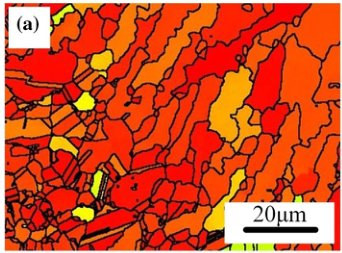

(a)

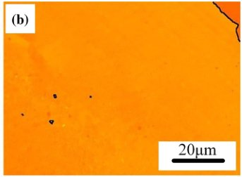

(b)

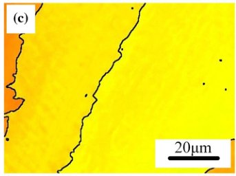

(c)

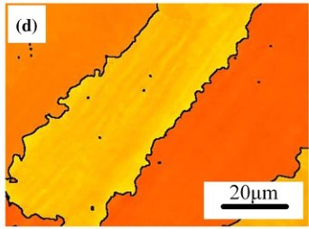

(d)

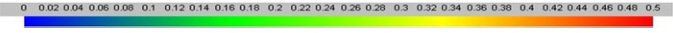

Fig. 11 Schmid factor intensity images corresponding to the HAZ, upper, center and root layers in the WZ

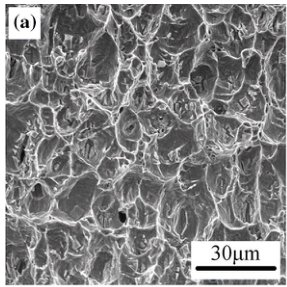

(a)

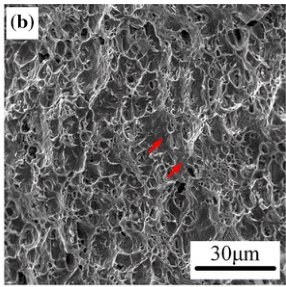

(b)

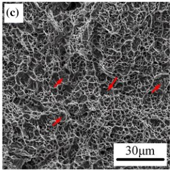

(c)

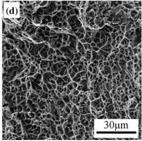

(d)

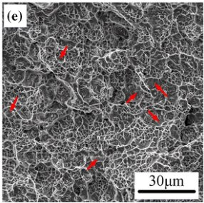

(e)

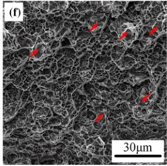

(f)

Fig. 12 SEM micrographs of fracture surface of impact test specimens for (a), (b) and (c) extracted from HAZ; and (d), (e) and (f) extracted from WZ. Both of them were performed at  $ 20^{\circ}\mathrm{C} $ ,  $ -120^{\circ}\mathrm{C} $  and  $ -196^{\circ}\mathrm{C} $ , respectively

3.3.4 Crack Propagation Mechanism. For any metal material, the microvoid coalescence mode is a typical ductile fracture mode, during plastic deformation, due to stress

concentrations originating from the intersection of different slip bands, glide planes and dislocation tangles (Ref 38). The trigger points of stress concentration result from the presence of

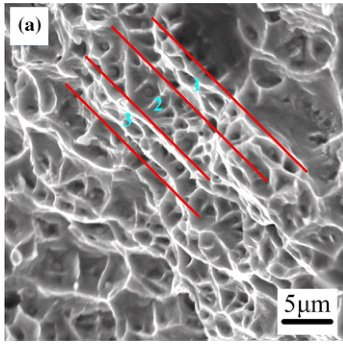

(a)

无

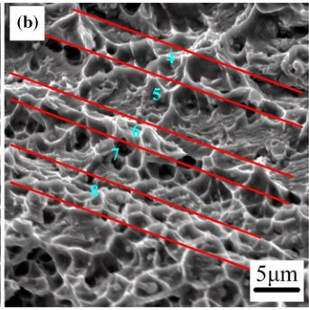

(b)

Fig. 13 Location magnification of the fracture surface of (a) WM tensile specimens and (b) cryogenic specimens impacted at -1

precipitates or inclusions clusters. With regard to the failure of the BM, the conventional microvoid coalescence mode plays a dominant role during deformation, as observed from Fig. 9 and 12. When the failures, after deformation, occur in the WZ, the SEM micrograph of the directional fracture texture from the local position of the fracture surface, at higher magnification, is depicted in Fig. 13. The fracture morphology of the WM, with plenty of dendritic sub-grains, indicates a clear directionality meaning that the crack spreads along the direction of the longitudinal axis of the dendritic sub-grains. This is because the existence of dendritic sub-grains can weaken the energy absorption capability, voids coalesce, and subsequently, the formed crack propagates along the major axis of the dendritic sub-grain leading to little branching. Thus, dendritic sub-grains can inhibit the uniform deformation.

Furthermore, it can be clearly seen that dense small dimples connected to each other in the inter-dendritic region (1, 3, 4, 6, 8 shown in Fig. 13), but little dimple occurs in the dendritic arm region (2, 5, 7 shown in Fig. 13). Thus, a segregation characteristic in dimple distribution is indicated due to the inhomogeneity during microvoid nucleation. A hardness discrepancy between the dendritic arm and the inter-dendritic area, caused by the high solution strengthening and high dislocation concentration in the dendritic sub-grain (Ref 28), results in the dislocation migration being impeded by the inter-dendritic region. The dislocation migration is limited in the elongated dendritic arm, and strong localized deformation occurs in the dendritic arm area. Thus, slip lines penetrate into the center of the dendritic arm, and the final failure occurs in the form of microvoid coalescence along the centerline (Ref 29, 39). Hence, the dendritic arm structure has a damaging effect on the plastic deformation, and the welding process should be optimized to reduce, or even eliminate, the dendritic microstructure. In addition, the few planar features of brittle fracture, observed in cryogenic conditions, are attributed to the stacking faults, slip bands and twinning (Ref 40). Meanwhile, the lack of  $ \delta $  ferrite in the welded joint has a helpful effect on the excellent cryogenic toughness.

# 3.4 Magnetic Properties

As mentioned above, some nonmagnetic ASSs are used in antimagnetic fields under ambient or even cryogenic conditions (Ref 41). Thus, the primary requirement is to ensure the lower

relative magnetic permeability, of nonmagnetic ASS, in any service environment. In the present case, the additions of high alloying elements, into the BM and FW, will affect the thermodynamic stability through the variation of the Gibbs energies (Ref 42). Hence, the martensitic transformation may occur in the experimental steel at cryogenic temperatures, or during plastic deformation (Ref 43), and the nonmagnetic character of the steel will not be guaranteed.

The specimens measured for their relative magnetic permeability (  $  \mu  $  ) were taken from the tensile specimens and the cryogenic impact specimens, respectively. The magnetic detected locations are in BM, HAZ and WZ. The   $  \mu  $   measurements are shown in the shape of magnetic hysteresis loops (B-H curves) at both ambient and liquid nitrogen temperatures. Magnetic hysteresis is measured by the complex interaction of irreversible and reversible variations in the magnetization process and expressed in the form of magnetic hysteresis loops (Ref 44). As can be seen in Table 4, the BM and welded joint reveal an excellent nonmagnetic character in which the   $  \mu  $  , under any measured conditions, keeps below   $  \sim1.003  $  . It can be clearly observed from Fig. 14 that all of the B-H hysteresis loops depict a perfect linear increase relationship of magnetization, in varying applied magnetic fields, which is considered as a sign of a paramagnetic material. The slopes of the straight-line segments of the B-H curves are almost the same. Additionally, as shown in Fig. 15, the x-ray profile at liquid nitrogen temperature is concurrent with the above phase analysis and further reveals the excellent paramagnetic characteristic and austenite phase stability of the welded joint.

# 4. Conclusions

The main conclusions from present study are as follows:

(1) The welded joint showed a satisfactory appearance with complete penetration, and no solidification defects were in evidence. On the side of the heat-affected zone near the base metal, slight grain growth occurred with an average grain size of  $ 18.9\mu \mathrm{m} $ . The primary dendritic arms, on both sides of the welding joint, grew along the direction of the temperature gradient and met at the centerline of the weld, with no parting microstructure being

Table 4 Relative permeability of weld plate after deformation at ambient and cryogenic temperature

| Deformation temperature   | Relative magnetic permeability, μ   | Relative magnetic permeability, μ   | Relative magnetic permeability, μ   |
|:--------------------------|:------------------------------------|:------------------------------------|:------------------------------------|
| Deformation temperature   | Base metal                          | Heat-affected zone                  | Weld zone                           |
| Ambient                   | 1.002726                            | 1.002846                            | 1.002743                            |
| Liquid nitrogen           | 1.002138                            | 1.002445                            | 1.002656                            |

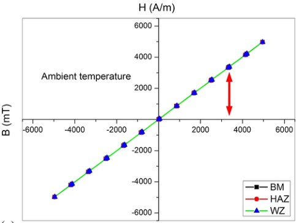

(a)

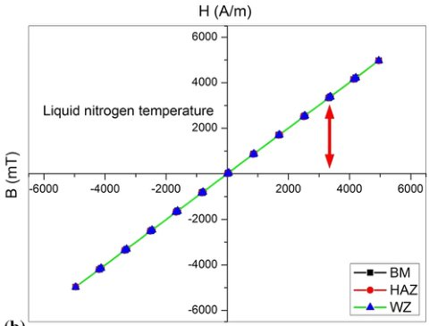

(b)

Fig. 14 Magnetization hysteresis loop of WM deformed at (a) ambient and (b)  $ -196^{\circ}\mathrm{C} $

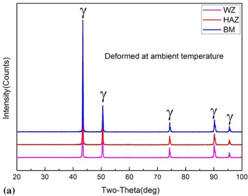

(a)

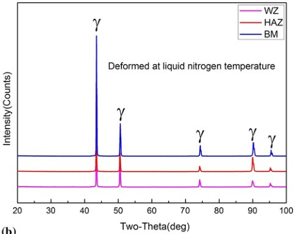

(b)

Fig. 15 X-ray patterns of WM deformed at (a) ambient and (b)  $ -196^{\circ}\mathrm{C} $

observed. The secondary dendritic arm spacing was stable in all parts of the weld zone. The measurement of the secondary dendritic arm spacing showed that the microstructure of the weld zone was finer than those of the fusion zone and the heat-affected zone.

(2) The hardness of the weld zone was higher than that of the base metal and the heat-affected zone, with the lowest hardness occurring in the heat-affected zone. The mechanical properties of the weld zone met the design requirements, and the yield strength, ultimate tensile

strength and elongation of the weld joint were 570.6 MPa, 879.3 MPa and 42.2%, respectively. The impact energy of the heat-affected zone was higher than that of the weld zone, corresponding to 60.5 J at room temperature and 52.7 J at -196 °C, and there was no obvious ductile-brittle transition.

(3) During the plastic deformation process, two kinds of crack propagation mechanisms existed in the weld zone. One was micropore aggregation fracture while the other was the dendrite arm-dendrite failure, which partly oc-

curred in the position of the dendrite cellular structure. The intensity of the dendrite arm was lower than that between the dendrites, and plastic deformation initially took place at the dendrite arm. The dislocation movement was hindered by the inter-dendritic region and was restricted to the dendrite arm. Finally, the dendritic arm region fractured first.

(4) The microstructure of the welded joint remained as full austenite after deformation at room temperature, and low temperature, which guaranteed a stable nonmagnetic performance, and the magnetic permeability was below 1.003.

# Acknowledgments

This work was supported by the joint financial support from the National Natural Science Foundation of China and Baowu Steel Group Co. Ltd (Grant No. U1660205).

# References

1. K. Lu, F.K. Yan, H.T. Wang, and N.R. Tao, Strengthening Austenitic Steels by Using Nanotwinned Austenitic Grains, Scr. Mater., 2012, 66, p 878–883

2. S.G. Chowdhury, S. Das, and P.K. De, Cold Rolling Behaviour and Textural Evolution in AISI, 316L Austenitic Stainless Steel, Acta Mater., 2005, 53, p 3951–3959

3. J. Xin, C. Fang, Y. Song, J. Wei, S. Xu, and J. Wu, Effect of Post Weld Heat Treatment on the Microstructure and Mechanical Properties of ITER-Grade 316LN Austenitic Stainless Steel Weldments, Cryogenics, 2017, 83, p 1–7

4. M. Koyama, T. Lee, C.S. Lee, and K. Tsuzaki, Grain Refinement Effect on Cryogenic Tensile Ductility in a Fe-Mn-C Twinning-Induced Plasticity Steel, Mater. Des., 2013, 49, p 234–241

5. B. Ma, C. Li, J. Zheng, Y. Song, and Y. Han, Strain Hardening Behavior and Deformation Substructure of Fe-20/27Mn-4Al-0.3C Non-magnetic Steels, Mater. Des., 2016, 92, p 313–321

6. H. Kim, Y. Ha, K.H. Kwon, M. Kang, N.J. Kim, and S. Lee, Interpretation of Cryogenic-Temperature Charpy Impact Toughness by Microstructural Evolution of Dynamically Compressed Specimens in Austenitic 0.4C-(22-26)Mn Steels, Acta Mater., 2015, 87, p 332–343

7. Y. Xiong, T. He, J. Wang, Y. Lu, L. Chen, F. Ren, Y. Liu, and A.A. Volinsky, Cryorolling Effect on Microstructure and Mechanical Properties of Fe-25Cr-20Ni Austenitic Stainless Steel, Mater. Des., 2015, 88, p 398–405

8. S. Lu, Q.M. Hu, B. Johansson, and L. Vitos, Stacking Fault Energies of Mn, Co and Nb Alloyed Austenitic Stainless Steels, Acta Mater., 2011, 59, p 5728–5734

9. M. Mukherjee and T.K. Pal, Evaluation of Microstructural and Mechanical Properties of Fe-16Cr-1Ni-9Mn-0.12N Austenitic Stainless Steel Welded Joints, Mater. Charact., 2017, 131, p 406–424

10. J.J. Lowke, Physical Basis for the Transition from Globular to Spray Modes in Gas Metal Arc Welding, J. Phys. D Appl. Phys., 2009, 42, p 135–204

11. K. Devendranath Ramkumar, A. Singh, S. Raghuvanshi, A. Bajpai, T. Solanki, M. Arivarasu, N. Arivazhagan, and S. Narayanan, Metallurgical and Mechanical Characterization of Dissimilar Welds of Austenitic Stainless Steel and Super-Duplex Stainless Steel—A Comparative Study, J. Manuf. Process., 2015, 19, p 212–232

12. D. Kianersi, A. Mostafaei, and A.A. Amadeh, Resistance Spot Welding Joints of AISI, 316L Austenitic Stainless Steel Sheets: Phase Transformations, Mechanical Properties and Microstructure Characterizations, Mater. Des., 2014, 61, p 251–263

13. A. Kumar, R.K. Soni, P. Ganesh, R. Kaul, V.K. Bhatnagar, J. Dwivedi, and L.M. Kukreja, A Study on Low Magnetic Permeability Gas Tungsten Arc Weldment of AISI, 316LN Stainless Steel for Application in Electron Accelerator, Mater. Des., 2014, 53, p 86–92

14. S. Sgobba, G. Hochoertler, A new non-magnetic stainless steel for very low temperature, In: Proceedings of International Congress in Stainless Steel, Chia Laguna, Italy, 91, 1999

15. Y.L. Song, C.S. Li, B.Z. Li, and Y.H. Han, Grain character and Mechanical Properties of Fe-21Cr-15Ni-6Mn-Nb Non-magnetic Stainless Steel After Solution Treatment, Mater. Sci. Eng. A, 2019, 742, p 662–671

16. Y.L. Song, C.S. Li, B.Z. Li, and Y.H. Han, Microstructure Characterisation of Fe-21Cr-15Ni-Nb-V Non-magnetic Austenitic Stainless Steel During Hot Deformation, Mater. Sci. Technol., 2018, 34, p 1639–1648

17. V. Shankar, T.P.S. Gill, S.L. Mannan, and S. Sundaresan, Solidification Cracking in Austenitic Stainless Steel Welds, Sadhana, 2003, 28, p 359–382

18. N.I. Kakhovskii, Effects of Silicon, Nitrogen and Manganese on Chemical Heterogeneity in Type 0Kh23N28M3D3T Weld Metals and Their Resistance to Hot Cracking, Avtomatich Svarka, 1971, 8, p 11–14

19. Y. Araki, H. Sano, M. Kominami, and H. Oikawa, Study on Cr-Ni Austenitic Filler Metal Containing Mn, Trans. Jpn. Weld. Soc., 1982, 13, p 32–40

20. J.A. Brooks and A.W. Thompson, Microstructural Development and Solidification Cracking Susceptibility of Austenitic Stainless Steel Welds, Int. Mater. Rev., 1991, 36, p 16–44

21. M. Alali, I. Todd, and B.P. Wynne, Through-Thickness Microstructure and Mechanical Properties of Electron Beam Welded 20 mm thick AISI, 316L Austenitic Stainless Steel, Mater. Des., 2017, 130, p 488–500

22. T.J. Lienert and J.C. Lippold, Improved Weldability Diagram for Pulsed Laser Welded Austenitic Stainless Steels, Sci. Technol. Weld. Join., 2013, 8, p 1–9

23. H. Vashishtha, R.V. Taiwade, S. Sharma, and A.P. Patil, Effect of Welding Processes on Microstructural and Mechanical Properties of Dissimilar Weldments Between Conventional Austenitic and High Nitrogen Austenitic Stainless Steels, J. Manuf. Process., 2017, 25, p 49–59

24. J.H. Yoon, E.P. Yoon, and B.S. Lee, Correlation of Chemistry, Microstructure and Ductile Fracture Behaviours of Niobium-Stabilized Austenitic Stainless Steel at Elevated Temperature, Scr. Mater., 2007, 57, p 25–28

25. C. Köse and R. Kaçar, The Effect of Preheat & Post Weld Heat Treatment on the Laser Weldability of AISI, 420 Martensitic Stainless Steel, Mater. Des., 2014, 64, p 221–226

26. S.H. Chowdhury, D.L. Chen, S.D. Bhole, E. Powidajko, D.C. Weckman, and Y. Zhou, Fiber Laser Welded AZ31 Magnesium Alloy: The Effect of Welding Speed on Microstructure and Mechanical Properties, Metall. Mater. Trans. A, 2012, 43(6), p 2133–2147

27. W. Qiang and K. Wang, Shielding Gas Effects on Double-Sided Synchronous Autogenous GTA Weldability of High Nitrogen Austenitic Stainless Steel, J. Mater. Process. Technol., 2017, 250, p 169–181

28. K. Saeidi, X. Gao, Y. Zhong, and Z.J. Shen, Hardened Austenite Steel with Columnar Sub-grain Structure Formed by Laser Melting, Mater. Sci. Eng. A, 2015, 625, p 221–229

29. X. Wenkai, Z. Li, Z. Fuju, D. Kesun, Z. Xian, Y. Xue, and C. Bingjun, Effect of Heat Input on Cryogenic Toughness of 316LN Austenitic Stainless Steel NG-MAG Welding Joints with Large Thickness, Mater. Des., 2015, 86, p 160–167

30. P. Vasantharaja, M. Vasudevan, and P. Palanichamy, Effect of Welding Processes on the Residual Stress and Distortion in Type 316LN Stainless Steel Weld Joints, J. Manuf. Process., 2015, 19, p 187–193

31. R.K. Desu, H. Nitin Krishnamurthy, A. Balu, A.K. Gupta, and S.K. Singh, Mechanical Properties of Austenitic Stainless Steel 304L and 316L at Elevated Temperatures, J. Mater. Res. Technol., 2016, 5, p 13–20

32. C. Tromas, J.C. Stinville, C. Templier, and P. Villechaise, Hardness and Elastic Modulus Gradients in Plasma-Nitrided 316L Polycrystalline Stainless Steel Investigated by Nanoindentation Tomography, Acta Mater., 2012, 60, p 1965–1973

33. S. Zhou, K. Zhang, Y. Wang, J.F. Gu, and Y.H. Rong, High Strength-Elongation Product of Nb-Microalloyed Low-Carbon Steel by a Novel Quenching-Partitioning-Tempering Process, Mater. Sci. Eng. A, 2011, 528, p 8006–8012

34. P. Behjati, A. Kermanpur, A. Najafizadeh, H. Samaei Baghbadorani, L.P. Karjalainen, J.G. Jung, and Y.K. Lee, Design of a New Ni-Free Austenitic Stainless Steel with Unique Ultrahigh Strength-High Ductility Synergy, Mater. Des., 2014, 63, p 500–507

35. X.L. Nan, H.Y. Wang, L. Zhang, J.B. Li, and Q.C. Jiang, Calculation of Schmid Factors in Magnesium: Analysis of Deformation Behaviors, Scr. Mater., 2012, 67, p 443–446

36. Werner Österle, Dirk Bettge, Bernard Fedelich, and Hellmuth KlingelhÖFFER, Modelling the Orientation and Direction Dependence of the Critical Resolved Shear Stress of Nickel-Base Superalloy Single Crystals, Acta Mater., 2000, 48, p 689–700

37. W. Gao, K. Chen, X. Guo, and L. Zhang, Fracture Toughness of Type 316LN Stainless Steel Welded Joints, Mater. Sci. Eng. A, 2017, 685, p 107–114

38. H.Y. Yi, F.K. Yan, N.R. Tao, and K. Lu, Work Hardening Behavior of Nanotwinned Austenitic Grains in a Metastable Austenitic Stainless Steel, Scr. Mater., 2016, 114, p 133–136

39. E.Y. Guo, M.Y. Wang, T. Jing, and N. Chawla, Temperature-Dependent Mechanical Properties of an Austenitic-Ferritic Stainless Steel Studied by In Situ Tensile Loading in a Scanning Electron Microscope (SEM), Mater. Sci. Eng. A, 2013, 580, p 159–168

40. M. Milititsky, D.K. Matlock, A. Regully, N. Dewispelaere, J. Penning, and H. Hanninen, Impact Toughness Properties of Nickel-

Free Austenitic Stainless Steels, Mater. Sci. Eng. A, 2008, 496, p 189–199

41. P. Oxley, J. Goodell, and R. Molt, Magnetic Properties of Stainless Steels at Room and Cryogenic Temperatures, J. Magn. Magn. Mater., 2009, 321, p 2107–2114

42. M. Hauser, M. Wendler, O. Fabrichnaya, O. Volkova, and J. Mola, Anomalous Stabilization of Austenitic Stainless Steels at Cryogenic Temperatures, Mater. Sci. Eng. A, 2016, 675, p 415–420

43. T. Sourmail and C.G. Mateo, Critical Assessment of Models for Predicting the Ms Temperature of Steels, Comput. Mater. Sci., 2005, 34, p 323–334

44. T.W. Shyr, S.J. Huang, and C.S. Wur, Magnetic Anisotropy of Ultrafine 316L Stainless Steel Fibers, J. Magn. Magn. Mater., 2016, 419, p 400–406

Publisher's Note Springer Nature remains neutral with regard to jurisdictional claims in published maps and institutional affiliations.

